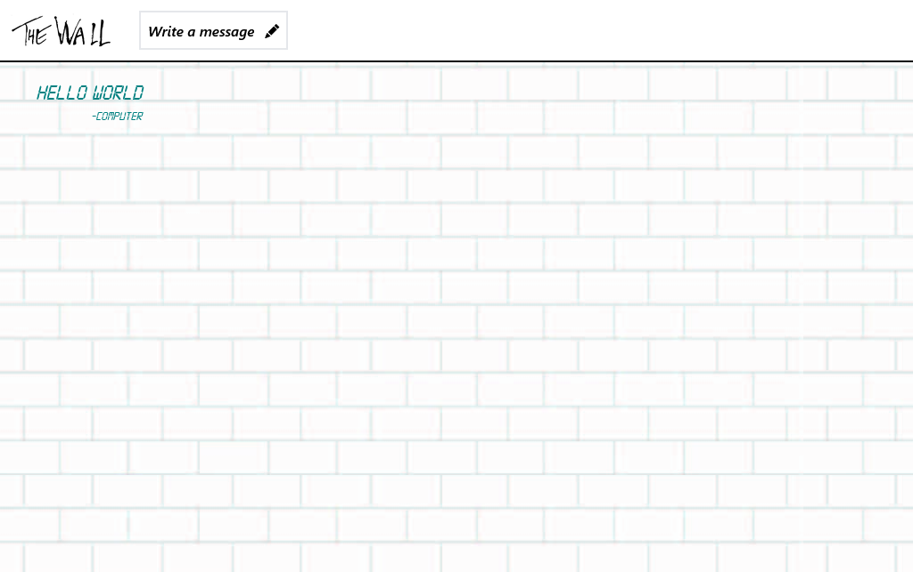

# The Wall

## Table of contents

- [Overview](#overview)
  - [The project](#the-project)
  - [Screenshot](#screenshot)
  - [Links](#links)
- [My process](#my-process)
  - [Built with](#built-with)
- [Author](#author)

## Overview

### The project

This project is an interactive message wall that allows users to post messages with the option to include their signature or author's name and customize the text with various available fonts and colors. Regarding the development, the application's frontend has been built using a set of technologies, including HTML, CSS, JavaScript, React, SASS, Tailwind, and Redux. On the other hand, the backend has been developed with Node.js and Express, responsible for managing the message database stored in MongoDB. Additionally, to streamline interactions with the database, Mongoose has been utilized.

### Screenshot

### Links

- Solution URL: [GitHub](https://github.com/SFCC5555/the-wall)
- Live Site URL: [The Wall](https://sfcc-the-wall.netlify.app/)

## My process

### Built with

- Semantic HTML5 markup
- CSS custom properties
- Flexbox
- Mobile-first workflow
- JavaScript
- Sass
- Tailwind
- [React](https://reactjs.org/) - JS library
- Redux
- Node.js
- Express
- MongoDB
- Mongoose

## Author

- Website - [Fernando Carrasco Portfolio](https://sfcc5555.netlify.app/)
